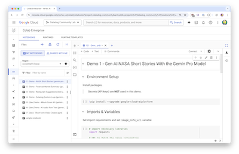

# Notebooks
Collection of Google Colab Enterprise / Jupyter Notebooks

## Google Cloud & Datadog Webinar
The following notebooks were highlighted during the February 7th webinar with Google Cloud and Datadog.

>NOTE: Sample .csv data is provided in the `data` directory. For the Restaurant Reviews, you'll need to obtain your own Google Places API key and create a `.env` file with your secrets in order to run without changes to the code snippets in the notebook.

- [Grocery Store Receipt Analysis](grocery-receipt-analysis.ipynb)
- [NASA Short Story](nasa-short-stories.ipynb)
- [Market Summary](market-summary.ipynb)
- [Restaurant Reviews](restaurant-reviews.ipynb)
- [Datadog Custom Logs & Metrics](datadog-custom-logs.ipynb)

>**Important** These notebooks were designed in Colab Enterprise which is part of Vertex AI. The authentication to many of the Vertex AI models are automatically handled when the notebooks are run from within a Colab Enterprise notebook from within Vertex AI. Running these notebooks from anywhere else won't work. The demo cloud function used in the webinar will be shutdown not long after the webinar takes place. [View the source code for the cloud function](cloud_function/get-nasa-image.py). You will need your own API which can be obtained from the [NASA APIs portal](https://api.nasa.gov/).

### Webinar Resources

- [Blog - Monitor Google Cloud Vertex AI with Datadog](https://dtdg.co/48Ls3dH)
- [Datadog AI Integrations](https://dtdg.co/3HykB9X)
- [Docs - Google Cloud Vertex AI Integration](https://dtdg.co/3HwCnKQ)
- [Gemini Migration Guide](https://ai.google.dev/docs/migrate_to_cloud)
- [PaLM-to-Gemini Migration Guide](https://ai.google.dev/docs/migration_guide)
- [Gemini on Vertex AI](https://cloud.google.com/vertex-ai/docs/generative-ai/multimodal/overview)
- [Built with Gemini](https://ai.google.dev/)
- [Gemini Examples](https://ai.google.dev/examples?keywords=googleai)
- [Vertex AI Generative AI Notebook Tutorials](https://cloud.devsite.corp.google.com/vertex-ai/docs/generative-ai/tutorials)

